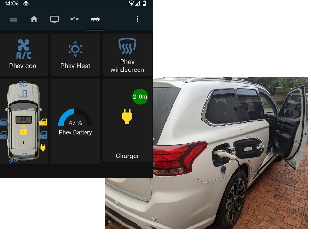

# phev2mqtt - Mitsubishi Outlander PHEV to MQTT gateway

Utility to interact with a Mitsubishi Outlander PHEV via the Wifi remote
control protocol.

Inspired by https://github.com/phev-remote/ but written entirely in Go.

For further hacking, read the [protocol documentation](protocol/README.md).

Tested against a MY18 vehicle.

## Supported functionality

 * MQTT proxy to Phev
 * Home Assistant discovery
 * Fetch battery, charge, door, light status
 * Set lights and charge enable
 * Near-instant response to commands
 * *Only tested on a MY18 Phev*

Also includes some debugging utilities.

## Requirements

 * Go compiler
 * To connect, a previously registered connection to a phone/tablet.
   * This library doesnt yet support client registration.

## Licence, etc

Licenced under the GPLv2.

Copyright 2021 Ben Buxton <bbuxton@gmail.com>

Contributions and PRs are welcome.

## Getting started.

### Compiling

#### Install Go

 * Download and install the latest [Go compiler](https://golang.org/dl/)
   * Your distro packager may have a version thats too old
   * For raspbian choose the ARMv6 release

#### Install PCAP dev libraries

 * Ensure you have install the libpcap-dev package

#### Download, extract, and compile phev2mqtt

 * Download the phev2mqtt archive
 * Extract it
 * Go into its the top level directory and run *go build*
 * Verify it runs with *./phev2mqtt -h*

### Connecting to the vehicle.

#### Register a mobile device with official app

As the program does not (yet) support client registration, you will first need to
register a phone/tablet to the car. Follow the [Mitsubishi instructions](https://www.mitsubishi-motors.com/en/products/outlander_phev/app/remote/)
and register the phone app to the car. You will need the Wifi credentials provided
with the car.

#### Obtain MAC address the app uses

Next, find the MAC address of the client. On your phone/table, go to Wifi settings,
search for the car SSID and find the MAC address used. On Android this will likely
be a randomised address. Note this address down.

#### Configure Wifi client on system running mqtt2phev

On your computer running the phev2mqtt tools, configure a new Wifi connection to the
car's SSID, and it's also essential to set the Wifi adapter mac address to the client
MAC address you noted above. Poke around online for how to do this for your system.

#### Testing the tool

Once connected to the car, you can sniff for messages by running *phev2mqtt client watch*.
The phone client needs to be disconnected for this to work.
You'll see a bunch of data go by - some of those will be decoded into readable
messages such as charge and AC status.

### MQTT Gateway

The primary feature of this code is to run as a proxy between the car and
MQTT. Registers with car status are sent to MQTT, both as raw register
values and decoded functional values. Commands sent on MQTT topics can
be used to control certain aspects of the vehicle.

Start the MQTT gateway with:

`./phev2mqtt client mqtt --mqtt_server tcp://<your_mqtt_address:1883/ [--mqtt_username <mqtt_username>] [--mqtt_password <mqtt_password>]`

The following topics are published:

| Topic/prefix | Description |
|---|---|
| phev/register/[register] | Raw values of each register, as hex strings |
| phev/available | Wifi connection status to car. *online* or *offline* |
| phev/battery/level | Current drive battery level as a percent |
| phev/climate/status | Whether the car AC is on |
| phev/climate/mode | Mode of the AC, if on. *cool*, *heat*, *windscreen* |
| phev/climate/[mode] | Alternative of above. Modes are *cool*, *heat*, *windscreen* which can be *off* or *on* |
| phev/charge/charging | Whether the battery is charging. *on* or *off* |
| phev/charge/plug | If the charging plug is *unplugged* or *connected*. |
| phev/charge/remaining | Minutes left, if charging. |
| phev/door/locked | Whether the car is locked. *on* or *off* |
| phev/door/front_left | State of doors. *closed* or *open* |
| phev/door/front_right | State of doors. *closed* or *open* |
| phev/door/rear_left | State of doors. *closed* or *open* |
| phev/door/rear_right | State of doors. *closed* or *open* |
| phev/door/bonnet | State of doors. *closed* or *open* |
| phev/door/boot | State of doors. *closed* or *open* |
| phev/lights/parking | Parking lights. *on* or *off* |
| phev/lights/head | Head lights. *on* or *off* |
| phev/vin | Discovered VIN of the car |
| phev/registrations | Number of wifi clients registered to the car |

The following topics are subscribed to and can be used to change state on the car:

| Topic/prefix | Description |
|---|---|
| phev/set/register/[register] | Set register 0x[register] to value 0x[payload] |
| phev/set/parkinglights | Set parking lights *on* or *off* |
| phev/set/headlights | Set head lights *on* or *off* |
| phev/set/cancelchargetimer | Cancel charge timer (any payload) |
| phev/set/climate/[mode] | Set ac/climate state (cool/heat/windscreen/off) for [payload] (10[on]/20/30) |

#### Home Assistant discovery

The client supports [Home Assistant MQTT Discovery](https://www.home-assistant.io/docs/mqtt/discovery/) by default.

After initial discovery, re-run the binary for the entities to appear. You can
search for "phev" in your entity list.

You can disable this with `--ha_discovery=false` or change the discovery prefix, the default is `--ha_discovery_prefix=homeassistant`.

### Sniffing the official client

Further development of this library can be done with a packet dump of the official
Mistubishi app.

A number of sniffer apps for phones are available for this. Two that the author have
used are *Packet Capture* and *PCAP Remote*. These do not require root access, yet
can successfully sniff the traffic into PCAP files for further analysis.

*Packet Capture* can save the PCAP files to your local phone storage which you can
then extract off the phone.

*PCAP Remote* is a little more involved, but allows for live sniffing of the traffic.

Once you have downloaded the PCAP file(s) from the phone, you can analyse them with
the command *phev2mqtt decode pcap <filename>*. Adjust the verbosity level (-v)
between 'info', 'debug' and 'trace' for more details.

Additionally, the flag '--latency' will use the PCAP packet timestamps to decode
the packets with original timings which can help pinpoint app events.

